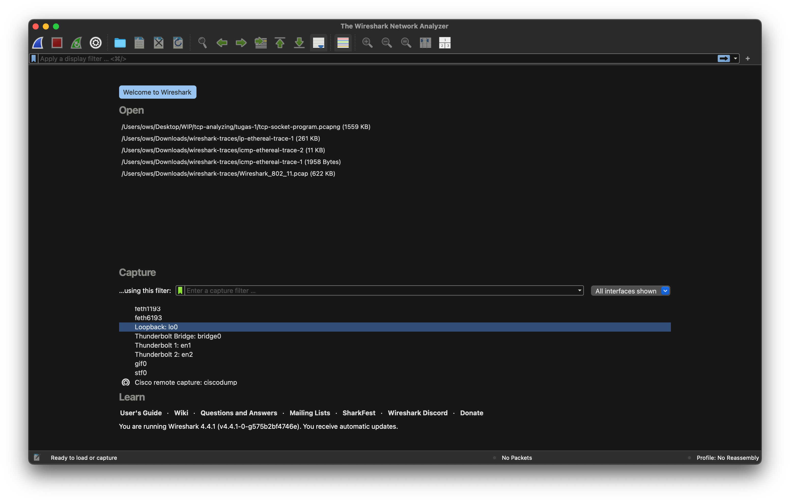
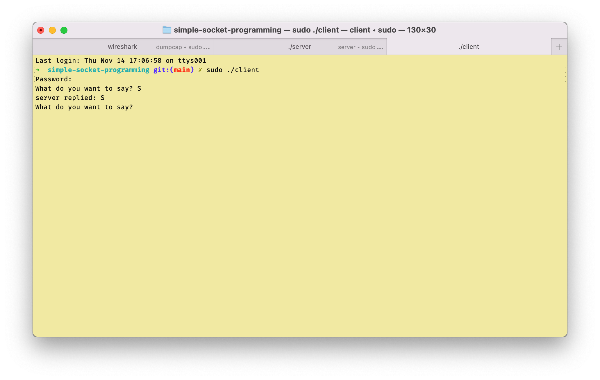
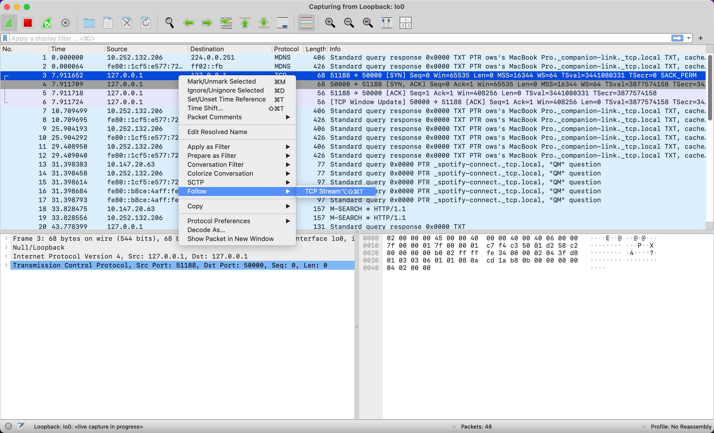
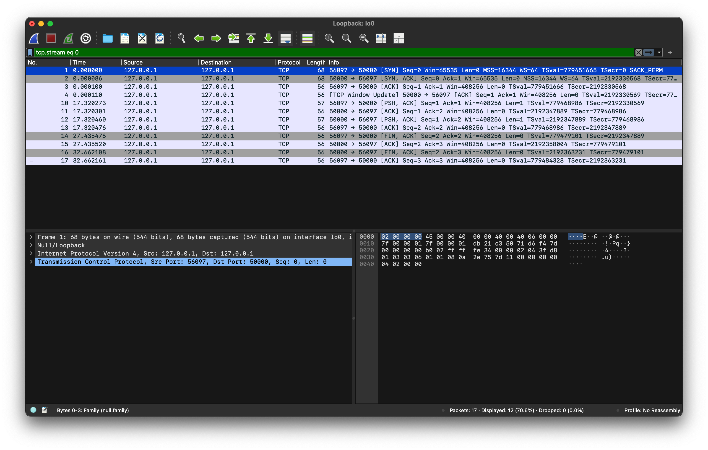
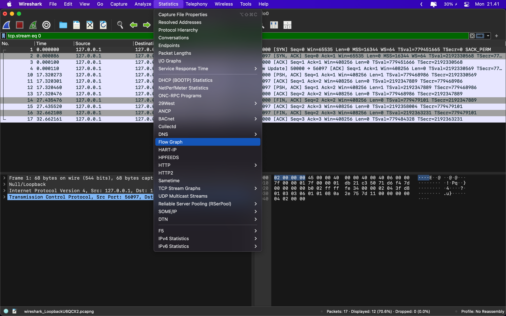
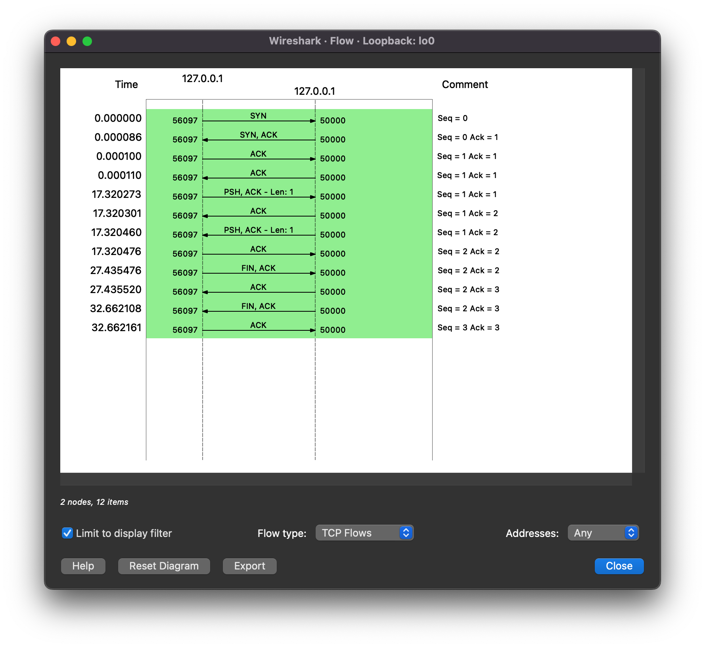

# Analisis TCP pada Simple Socket Programming

Tutorial ini menjelaskan bagaimana TCP bekerja pada Socket Program dengan bantuan Wireshark

## 1. Prepare Program Socket
Buka direktori `/simple-socket-programming`
<br>
*Note: pada case ini port number yang digunakan adalah 50000*

1. Buka file `server.c`, sesuaikan port number yang diinginkan pada **line 40**, <br>
```C
...
    const uint16_t port_number = 50000;
...
```

2. Buka file `client.c`, samakan nilai port number dengan file `server.c` pada **line 19**
```C
...
    portno = 50000;
...
```


## 2. Running Program Socket
1. Buka app terminal
2. Masuk ke direktori `cd {path_to_root_dir}/tugas-1/simple-socket-programming`
3. Jalankan perintah `make`
4. Jalankan aplikasi Wireshark `sudo wireshark`
5. Pilih Loopback: lo0

5. Jalankan app server `sudo ./server`
6. Jalankan app client `sudo ./client`
7. Kirim plaintext ke server

8. Kemudian kita terminate app client, `Ctrl+C`

## 3. Analyze Wireshark

1. Klik kanan pada packet yang akan di stream. Cari packet dengan port address 50000.
2. Follow -> TCP stream 

3. Maka aplikasi Wireshark hanya akan menampilkan packet TCP yang di stream saja

4. Kemudian pilih menu Statistic -> Flow Graph

5. Tampil hasil Flow Graph TCP. Centang **Limit to display filter**. **Flow type: TCP FLows**

