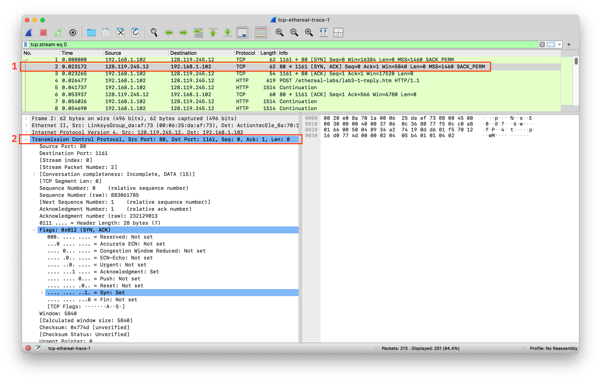
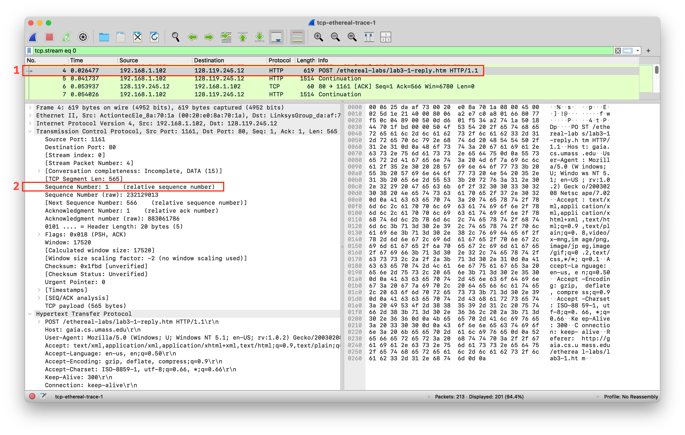

# UAS S2 24-25 
Analisis menggunakan Wireshark pada file [_tcp-ethereal-trace-1_](./assets/tcp-ethereal-trace-1) di dalam [.zip](http://gaia.cs.umass.edu/wireshark-labs/wireshark-traces.zip)

## Question 1
What is the IP address and TCP port number used by your client computer (source) to transfer the file to gaia.cs.umass.edu?

IP Address : `192.168.1.102`  
TCP Port : `1161`

## Question 2
What does gaia.cs.umass.edu use the IP address and port number to receive the file. (Attach the screenshot of your Wireshark's display)

IP Address : `128.119.245.12`  
TCP Port : `80`

## Question 3
What is the sequence number of the TCP SYN segment that is used to initiate the TCP connection between the client computer and gaia.cs.umass.edu? What is it in the segment that identifies the segment as a SYN segment? (Attach the screenshot of your Wireshark's display)

Attention **red square** on the image above.  
1. First of all, select the **first row** packet.
2. Then expand packet TCP
3. Look at field `FLags` value
 
Sequence Number : `0`  
Flags : `SYN` (Proof the segment identifies as a SYN segment)
 
Video penjelasan:  
<video src="./assets/q3-syn.mp4" width="640" height="320" controls></video>

## Question 4
What is the sequence number of the SYNACK segment sent by gaia.cs.umass.edu to the client computer in reply to the SYN? What is the value of the ACKnowledgement field in the SYNACK segment? How did gaia.cs.umass.edu determine that value? What is it in the segment that identifies the segment as a SYNACK segment? (Attach the screenshot of your Wireshark's display)

Attention **red square** on the image above.  
1. First of all, select the **second row** packet.
2. Then expand packet TCP
  
Sequence Number : `0`  
Acknowledgement Number : `1`  
Flags : `SYN`, `ACK` (Proof the segment identifies as a SYN, ACK segment)  
> The Acknowledgement Number (ACK) in a TCP header is the next number/byte (**Sequence Number from sender/response previously + 1**) of segment.

## Question 5
What is the sequence number of the TCP segment containing the HTTP POST command? Note that in order to find the POST command, you’ll need to dig into the packet content field at the bottom of the Wireshark window, looking for a segment with a “POST” within its DATA field.(Attach the screenshot of your Wireshark's display)

Attention **red square** on the image above.  
1. First of all, select the **4th row** packet.
2. Then expand packet TCP
 
 
Sequence Number : `1`  
The Client send POST command with `Flags` `PSH`, `ACK`

## Question 6
Consider the TCP segment containing the HTTP POST as the first segment in the TCP connection. What are the sequence numbers of the first six TCP connection segments (including the HTTP POST segment)? At what time was each segment sent? When was the ACK for each segment received? Given the difference between when each TCP segment was sent, and when its acknowledgement was received, what is the RTT value for each of the six segments? What is the EstimatedRTT value (see page 237 in textbook) after the receipt of each ACK? Assume that the value of the EstimatedRTT is equal to the measured RTT for the first segment, and then is computed using the EstimatedRTT equation on page 237 for all subsequent segments.

> Note: Wireshark has a nice feature that allows you to plot the RTT for each of the TCP segments sent. Select a TCP segment in the “listing of captured packets” window that is being sent from the client to the gaia.cs.umass.edu server. Then select: Statistics->TCP Stream Graph->Round Trip Time Graph.

The Sequence number first six TCP Connection (include HTTP POST) from Client to Server :  
1st Sequence : `1` 
2nd Sequence : `566` 
3rd Sequence : `2026` 
4th Sequence : `3486` 
5th Sequence : `4946` 
6th Sequence : `6406` 
 
Each segment was sent when the receiver sent `Flag` `ACK` number = next `byte`
 
Time each six segment sent is ACK from Server to Client: 
1st Time : `0,053937` 
2nd Time : `0,077294` 
3rd Time : `0,124085` 
4th Time : `0,169118` 
5th Time : `0,217299` 
6th Time : `0,267802` 
 

RTT value:  
1st Time : `27,5ms` 
2nd Time : `35,5ms` 
3rd Time : `70ms` 
4th Time : `114,5ms` 
5th Time : `139,9ms` 
6th Time : `189,8ms` 

## Question 7
What is the length of each of the first six TCP segments?(Attach the screenshot of your Wireshark's display)

Len value:  
1st Len : `565` 
2nd Len : `1460`  
3rd Len : `1460`  
4th Len : `1460`  
5th Len : `1460`  
6th Len : `1460`  

